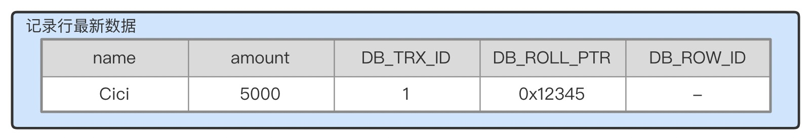
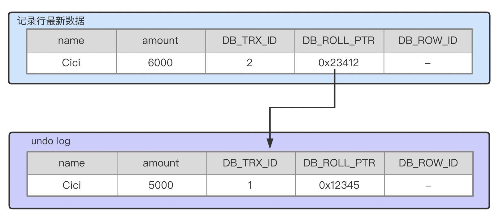
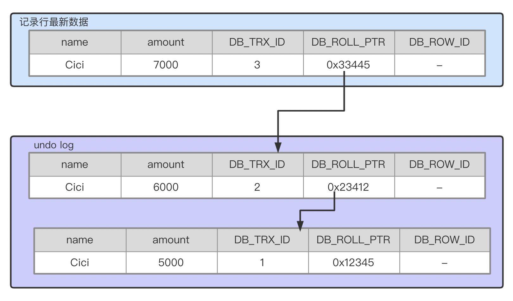
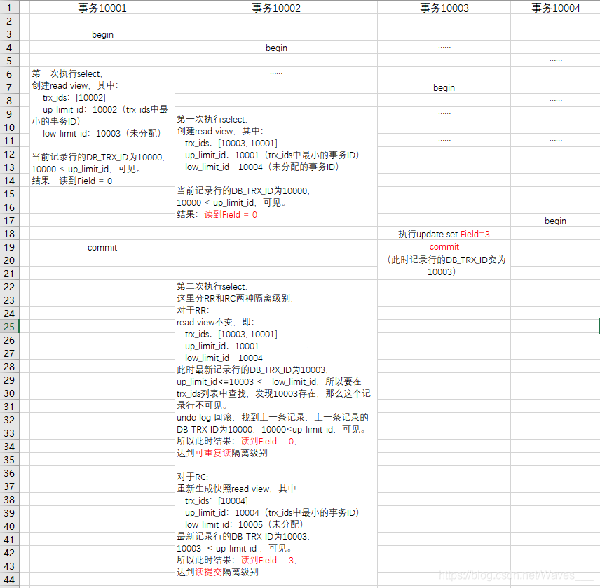

# 原理[^1]

本文主要参考: [MySQL中MVCC的正确打开方式（源码佐证）](https://blog.csdn.net/Waves___/article/details/105295060#comments_14464150)

### 依赖条件
#### 隐藏字段
InnoDb在每行数据后面添加3个字段
1. DB_TRX_ID: 最近一次修改(insert/update)的事务ID。delete操作被当作update操作处理，回去update一个特殊的位标记位删除。
2. DB_ROLL_PTR(roll pointer): 指向在rollback segment的一条undo log(包含了回滚这一行需要的信息)。
3. DB_ROW_ID: 随着新的行insert而单调递增的id。

#### Read View
用于事务的可见性判断，决定了一个事务的操作对当前事务是否可见。

部分结构  
1. low_limit_id: "最高水位线标记"， >= 此标记的事务无法被当前事务看见。目前出现过的最大 事务id+1，即下一个被分配的事务id。
2. up_limit_id: "最低水位线标记"，< 此标记的事务无法被当前事务看见。若活跃事务trx_ids不为空, 是trx_ids中最小的事务id(trx_ids倒序排列，因此就是最后一个), 否则等于low_limit_id。
3. trx_ids: Read View创建时其他未提交的活跃的事务id列表。不包括当前事务和已提交的事务。范围应该是[up_limit_id, low_limit_id)
4. creator_trx_id: 当前事务id

例子

|low_limit_id | up_limit_id | trx_ids | creator_trx_id
-|-|-|-|-
trx_ids不为空| 15 | 20 | 18, 17 | 13
trx_ids为空| 20 | 20 | | 13

#### Undo Log
记录对数据的变更操作。undo log形成一条链表，可以顺着链表读到旧版本的数据。

大多数对数据的变更为insert/delete/update，其中insert操作在事务提交前仅对当前事务可见，仅在事务回滚时需要，在commit之后可以立即删除。
update/delete归为一类为update_undo，不仅在事务回滚时需要，在快照读时也需要。只有当数据库使用的快照中不涉及该log时，才会被purge线程删除。

### Undo Log形成过程
假设有一个表person

column| type
-|-
guid | varchar(32)
name | varchar(32)
amount | int

已有一条记录行

事务A将cici的amount修改为6000:  
1. 对记录行添加排他锁[^2]
2. 拷贝该行数据到undo log
3. 修改该行数据，回滚指针指向上一版本
4. 事务提交，释放排他锁

事务B将cici的amount修改为7000:  
1. 对记录行添加排他锁[^2]
2. 拷贝该行数据到undo log
3. 修改该行数据，回滚指针指向上一版本
4. 事务提交，释放排他锁

### 可见性算法
每次事务开启后执行第一个select语句时，会创建一个Read View，当事务读取到某一记录行时，会将该记录行的DB_TRX_ID和Read View比较，决定该记录行是否可见。

假设当前事务要读取某一个记录行，该记录行的DB_TRX_ID为trx_id，该记录行对当前事务是否可见的判断逻辑如下: 
1. 如果trx_id < up_limit_id，则该记录行可见
2. 如果trx_id >= low_limit_id，则该记录行不可见
3. 如果up_limit_id <= trx_id < low_limit_id，则要根据trx_ids决定该记录行是否可见。如果trx_id存在于trx_ids中，则不可见，否则则可见。

### 例子
假设存在当前数据行
Field | DB_ROW_ID | DB_TRX_ID | DB_ROLL_PTR
-|-|-|-
0 | 1 | 10000 | 0x12345

[^1]: MVCC仅在READ COMMITTED和REPEATABLE READ两个隔离级别下工作。READ UNCOMMITTED总是读取最新数据，不需要版本控制，SERIALIZABLE总是对数据加锁，而非寻找可见的版本

[^2]: update时会对该行添加排他锁(不严谨地来说，也可能是别的层级的锁，取决于索引情况、隔离级别等，需要在另一篇中具体分析)

